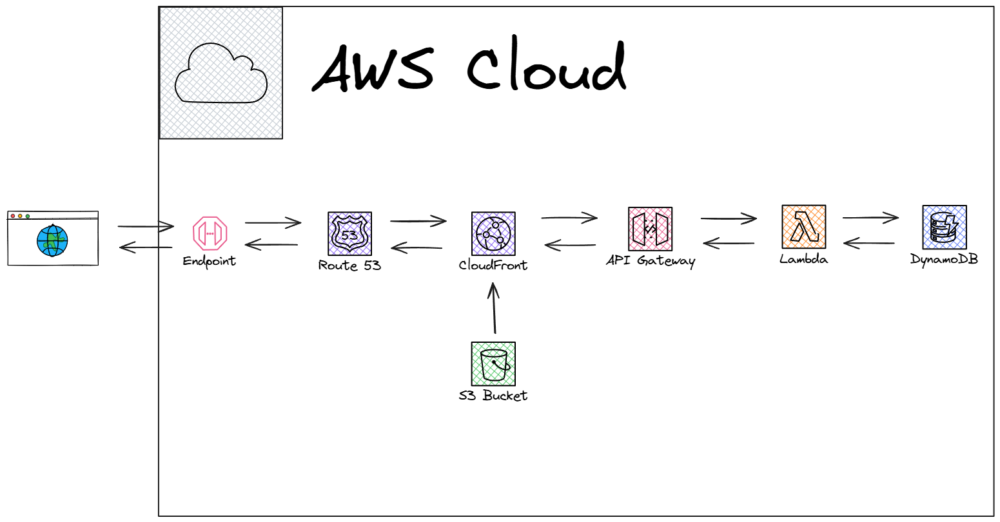

# Desafio Técnico: Calculadora de Rentabilidade Acumulada

Esta é uma solução completa para o desafio, envolvendo um backend em FastAPI com arquitetura em camadas(inspirado no modelo MVC para ajudar na organização), banco de dados PostgreSQL, um frontend em React e containerização com Docker.

## Estrutura do Projeto

O projeto está organizado dentro de uma pasta raiz com as seguintes subpastas principais:
- **/backend**: Contém a API em FastAPI, seguindo uma estrutura com `routes`, `controllers` e `models`.
- **/frontend**: Contém a interface web em React.
- **docker-compose.yml**: Orquestra a execução dos containers, incluindo um serviço para o banco de dados PostgreSQL.
- **.env**: Arquivo para configurar as variáveis de ambiente do banco de dados.

## Tecnologias Utilizadas

- **Backend**: Python, FastAPI, SQLAlchemy, Pandas, Pydantic
- **Frontend**: JavaScript, React, Axios
- **Banco de Dados**: PostgreSQL
- **Containerização**: Docker, Docker Compose

## Como Executar a Aplicação

**Pré-requisitos:**
- Docker
- Docker Compose

**Passos:**

1.  **Clone o repositório:**
    ```sh
    git clone https://github.com/danielguilhermino/calculadora
    cd desafio-financeiro
    ```

2.  **Configure o ambiente:**
    - Renomeie o arquivo `.env.example` (se houver) para `.env` ou crie um novo arquivo `.env` na raiz do projeto com o seguinte conteúdo:
      ```env
      POSTGRES_USER=admin
      POSTGRES_PASSWORD=desafiovanguarda
      POSTGRES_DB=desafio_db
      POSTGRES_HOST=db
      ```

3.  **Construa e inicie os containers:**
    O `docker-compose` cuidará de tudo: construir as imagens, iniciar o banco de dados, basta esperar que ele esteja pronto e, em seguida, iniciar o backend e o frontend com o comando abaixo.
    ```sh
    docker-compose up --build
    ```

4.  **Acesse a aplicação:**
    - **Frontend (Interface Web)**: Abra seu navegador e acesse `http://localhost:3000`
    - **Backend (API Docs)**: Acesse `http://localhost:8000/docs` ou `http://localhost:8000/redoc` para ver a documentação interativa da API.

## Arquitetura e Decisões Técnicas
- **Arquitetura Backend**: O backend foi pensado em uma arquitetura em camadas (`routes`, `controllers`, `models`) para melhor separação de responsabilidades e escalabilidade.
- **PostgreSQL**: Optei pelo PostgreSQL. O `docker-compose` gerencia o ciclo de vida do serviço do banco.
- **Carregamento de Dados**: A lógica de carregamento do CSV foi incluida na inicialização do backend para garantir que a base esteja de acordo.
- **Healthcheck do Banco**: O `docker-compose` utiliza um `healthcheck` para garantir que o serviço de backend só inicie após o banco de dados PostgreSQL estar pronto para aceitar conexões, evitando erros de inicialização.

## Prévia online

Aproveitei para disponibilizar uma prévia que pode ser acessada através do link:

https://calculadora.inteligente.app

Utilizei a arquitetura abaixo na AWS:



** Motivos: **

- Custo próximo de zero para manter a aplicação em funcionamento 24/7;
- Aplicação com auto scaling nativo, consigo ir de 1 a 1 milhão de acesso sem gargalos e me preocupar com infra;
- Free tier generoso da AWS nos serviços serverless, a aplicação pode ter milhares de acessos mensalmente e continuará custando poucos centavos.
